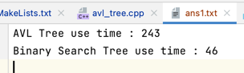
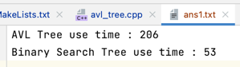
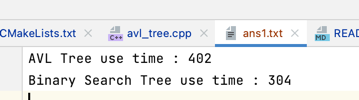
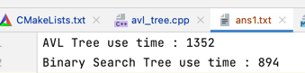
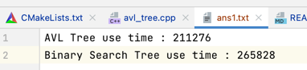

# AVL Tree & BST
## 随机数生成代码
见dataGen.cpp

```cpp
#include <iostream>
#include <time.h>
#include <unordered_set>
#include <fstream>
using namespace std;

unordered_set<int> table;
unordered_set<int> del;

int genRandomInt() {
    return rand() % RAND_MAX;
}
int genRandomDel(int n) {
    return rand() % n;
}
int main() {
    ifstream fin("dataGen5");
    ofstream fout("test1.txt");
    std::srand(time(0));
    int n;
    fin >> n;
    int a[n];
    for (int i = 0; i < n; ++i) {
        int tmp = genRandomInt();
        while (table.find(tmp) != table.end())
            tmp = genRandomInt();
        table.insert(tmp);
        a[i] = tmp;
    }

    fout << 'i' << endl;

    for (auto it: table) {
        fout << it << endl;
    }

    fout << 'r' << endl;

    for(int i = 0; i < n/10; ++i) {
        int tmp = genRandomDel(n);
        while(del.find(tmp) != del.end())
            tmp = genRandomDel(n);
        del.insert(tmp);
        fout << a[tmp] << endl;
    }
//the second time
    fout << 'i' << endl;

    for (auto it: table) {
        fout << it << endl;
    }

    fout << 'r' << endl;

    for(int i = 0; i < n/10; ++i) {
        int tmp = genRandomDel(n);
        while(del.find(tmp) != del.end())
            tmp = genRandomDel(n);
        del.insert(tmp);
        fout << a[tmp] << endl;
    }


```
* 本代码共生成两次随机数 ： 
  * 第一次： n次插入， n/10次删除
  * 第二次： n次插入， n/10次删除
  * 故总次数分别为: `110`, `220`, `1100`,`2200`,`4400`
* 运行程序前注意修改工作目录
* 若`avl_tree.cpp`运行不会终止， 请停止运行， 并且重新生成数据
  * `dataGen.cpp`bug : 不会检验随机数是否相同。。。。。。
    * 但是运气好一般不会相同 :)
****

## 时间生成 & 确保实验公平方法

### 时间生成
**AVL Tree**
```cpp
clock_t start = clock();
AVL<int> avl;
for(int i = 1; i <= 100; i++) {
fin >> e;
avl.insert(e);
}
for(int i = 1; i <= 10; i++) {
fin >> e;
avl.remove(e);
}
clock_t end = clock();
double elapsed_secs = static_cast<double>(end - start);
fout << "AVL Tree use time : " << elapsed_secs << '\n';
```
**BST**
```cpp
start = clock();
    BST<int> bst;
    for(int i = 1; i <= 100; i++) {
        fin >> e;
        bst.insert(e);
    }
    for(int i = 1; i <= 10; i++) {
        fin >> e;
        bst.remove(e);
    }
    end = clock();
    elapsed_secs = static_cast<double>(end - start);
    fout << "Binary Search Tree use time : " << elapsed_secs << '\n';
```

### 确保实验公平
* 两数据结构各函数调用次数相同，插入数据相同，（查找数据不同）
* 两数据结构的插入和删除操作均使用递归写法

## 时间测试
|                          测试                           |            1            |  2  |  3  |            4            |            5            |            6            |
|:-----------------------------------------------------:|:-----------------------:|:---:|:---:|:-----------------------:|:-----------------------:|:-----------------------:|
|                          数据量                          |           50            | 100 | 500 |          1000           |          2000           |         100000          |
|                       AVL Tree                        |           243           | 206 | 402 |          1352           |          2140           |         211276          |
|                          BST                          |           46            |  53  | 304 |           894           |          2047           |         265828          |
|                          png                          |  |     ||  |  |  |
## 结论
* 面对更大数据 AVL Tree 从时间上优于 BST
  * 由于AVL树算法实现较为复杂，故数据量较小时无法看出AVL树的时间优越性
  * 并且由于二叉搜索树未保证子树的平衡，那么面对有序树的输入则会显示其较大弊端